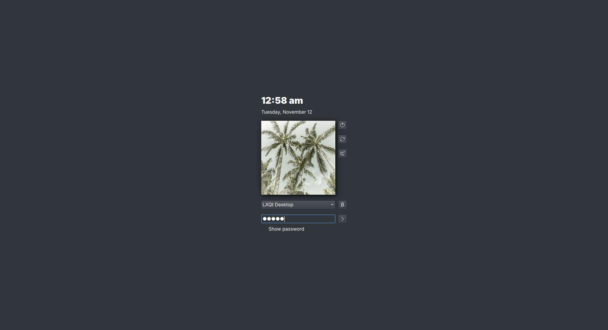
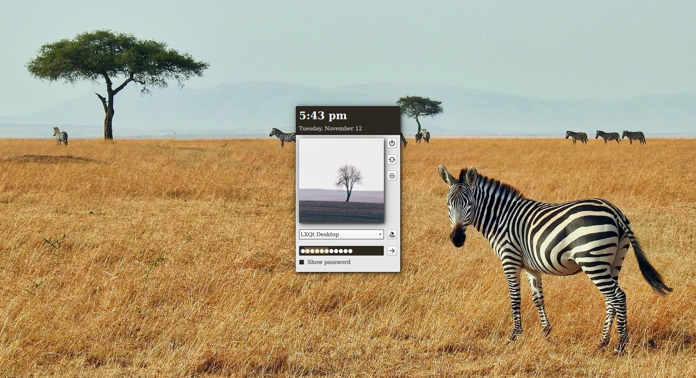
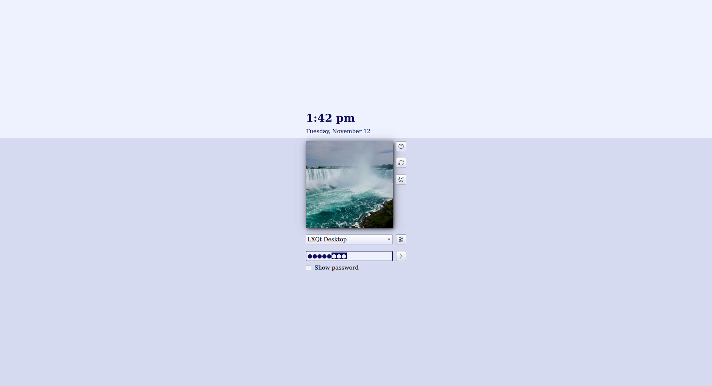
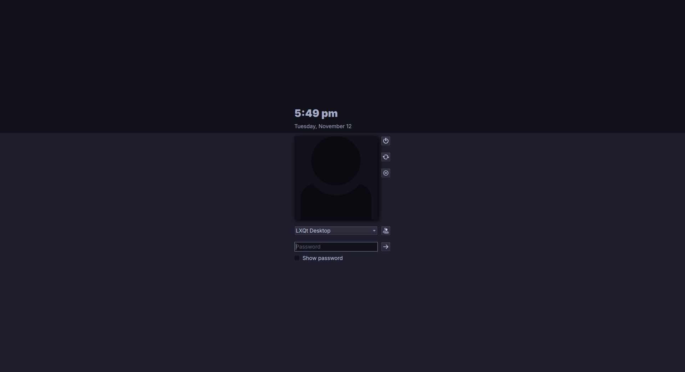
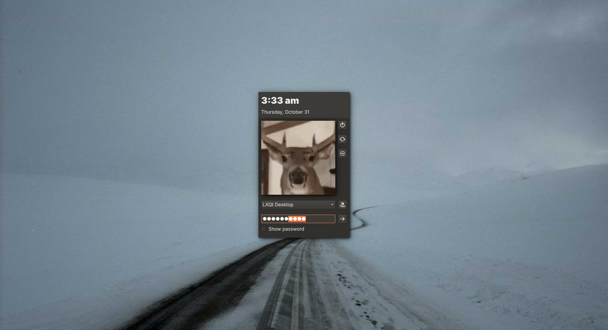

# Tidy SDDM
A tidy theme for [SDDM](https://github.com/sddm/sddm) Qt6

*Create your own custom color palette or use one of the 20+ palettes included in the theme.conf file*

## Previews

</img>
</img>
</img>
</img>

## Dependencies
- sddm
- qt6 >= 6.7
- qt6-declarative (Qt Quick)
- qt6-svg

## Install
1. Either download and extract the tidy-sddm.tar.xz from the [releases](https://github.com/loadfred/tidy-sddm/releases/latest) or use `git clone`

```
git clone https://github.com/loadfred/tidy-sddm
```

2. Move this entire repository to `/usr/share/sddm/themes/`

```
sudo mv ./tidy-sddm /usr/share/sddm/themes/
```

3. Create and edit `/etc/sddm.conf` to say ...

```
[Theme]
Current=tidy-sddm
```

## .face.icon
If you want a user avatar, copy any image to your home folder and name it `.face.icon`

NOTE: If no image is shown, SDDM needs permission to open your home folder, this can be done with `sudo chmod o+X /home/myuser`

## theme.conf
Everything configurable is listed and explained in the [`theme.conf`](theme.conf)

```
[General]
LayoutMirroring=false
ChooseUser=false
MilitaryTime=false
DisableTopHalfColor=false
FontPointSize=11
FontFamily=Inter
Background=
Icons=kora
Palette=Blender
```

### Background
For a background image, enter the full path

`Background=/home/myuser/Pictures/greenforest.png`

Otherwise the base and window colors from your chosen palette will be used for the background

NOTE: If no image is shown, SDDM needs permission to open your home folder, this can be done with `sudo chmod o+X /home/myuser`

### Icons
You may choose either adwaita, breeze, or kora

`Icons=breeze`

### Palettes
There are 20+ different color palettes in the config ready to use

`Palette=Breeze Dark`

You may create your own color palette using Hex codes (#ffa03d) or color names (orange) using the following properties ...

```
[Palette Name]
Base=
Highlight=
HighlightedText=
Shadow=
Text=
Window=
WindowText=
```

The majority of the palettes written in `theme.conf` are from [lxqt-themes](https://github.com/lxqt/lxqt-themes/tree/master/palettes)

#### Palette groups
You may create a group within a palette for an easy color change on a specific property or multiple properties

The group name is written before the property with a `/` seperating them: `Red Group/Base=#f00`

The palette's group can be chosen with `Palette=Palette Name/Red Group`

Here's an example ...
```
[Gruvbox Dark]
Base=#282828
### Default highlight
Highlight=#928374
### Various highlight colors, chosen with "Palette=Gruvbox Dark/yellow"
red/Highlight=#fb4934
yellow/Highlight=#fabd2f
green/Highlight=#b8bb26
aqua/Highlight=#8ec07c
blue/Highlight=#83a598
purple/Highlight=#d3869b
HighlightedText=#1d2021
Shadow=black
Text=#d5c4a1
Window=#3c3836
WindowText=#ebdbb2
```
The palette above can be chosen with either `Palette=Gruvbox Dark`, `Palette=Gruvbox Dark/yellow`, `Palette=Gruvbox Dark/purple`, etc.
